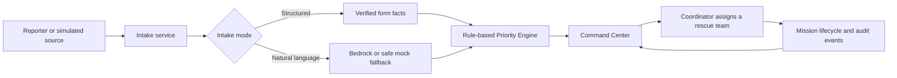
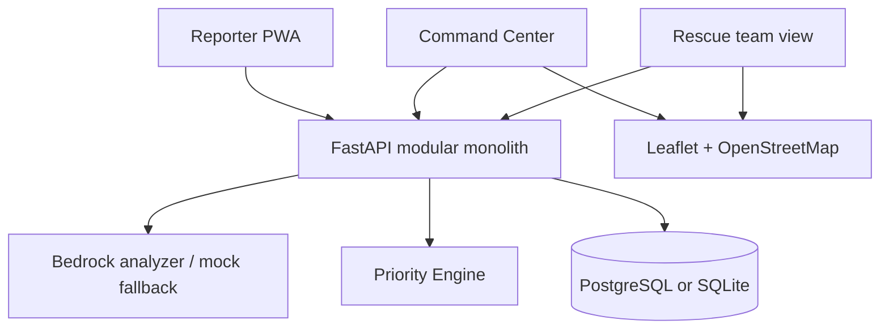

# SOSFlow

SOSFlow is an emergency-intake and rescue-dispatch MVP for disaster response. It turns incoming SOS reports into an operational queue: reports are normalized, prioritized with explainable rules, reviewed by a command center, assigned to rescue teams, and tracked through mission completion.

It is designed for a hackathon/local-demo environment, not as a replacement for emergency hotlines or a production emergency-management system.

## What it demonstrates

- Two SOS intake modes:
  - **Structured intake** uses explicit facts entered by the reporter and calculates priority without calling AI.
  - **Natural-language intake** accepts a single free-text SOS message and uses Amazon Bedrock Converse structured output when configured.
- A rule-based, explainable Priority Engine with deterministic time aging.
- A Command Center with operational KPIs, filters, pagination, map markers, source/status charts, and action alerts.
- Simulated multi-source intake from `WEB`, `CALL_112`, `PHONE`, `SMS`, `ZALO`, `SOCIAL_MEDIA`, `LOCAL_OFFICER`, and `OFFLINE_SYNC`.
- Explainable duplicate-report candidates; a coordinator decides whether to confirm and merge them.
- Explainable rescue-team recommendations, manual assignment, controlled mission transitions, and mission event history.
- An offline-first Reporter PWA backed by IndexedDB and idempotent synchronization.
- A repeatable Trà Linh flood-and-landslide scenario with silent-zone verification alerts.

> SMS, Zalo, 112, social-media and What3words sources are **simulators** in this MVP. They are not production gateway integrations.

## Quick start

### Local demo (recommended)

The dedicated demo Compose file avoids exposing PostgreSQL and Redis on their default host ports.

```bash
git clone <repository-url>
cd sosflow
cp .env.example .env
DEMO_TOKEN=sosflow-demo docker compose -p sosflowlocaldemo -f docker-compose.local-demo.yml up -d --build
```

Open:

- Command Center: <http://localhost:5174/admin/dashboard>
- Reporter: <http://localhost:5174/report>
- API documentation: <http://localhost:8001/docs>

On the dashboard, select **Start simulation** to play the Trà Linh scenario. The control panel supports pause, next event, inject all, reset, and x1/x2/x5 playback speeds.

### Standard local stack

```bash
docker compose up --build
```

- Frontend: <http://localhost:5173>
- Backend: <http://localhost:8000>
- API documentation: <http://localhost:8000/docs>

## Core workflow



SOSFlow is a modular FastAPI monolith. The Priority Engine is the source of truth for priority. AI extracts and suggests information from natural language; it never automatically assigns a team or initiates a rescue mission.

## Main capabilities

### Explainable priority and aging

Priority uses transparent rules configured in [`config/priority-rules.yaml`](config/priority-rules.yaml). Inputs include people affected, children, elderly people, injuries, trapped status, water level, vulnerable people, message risks, and waiting time.

Priority levels are:

| Score | Level |
| --- | --- |
| 0–29 | `LOW` |
| 30–49 | `MEDIUM` |
| 50–69 | `HIGH` |
| 70+ | `CRITICAL` |

All backend timestamps are UTC ISO 8601. Aging accepts an explicit `now` value in the engine for deterministic tests. Open requests are refreshed at a controlled interval when lists, details, or statistics are loaded, avoiding a database write for every GET request.

### Data integrity and mission lifecycle

- Human-readable request codes use database identity plus a short UUID token, for example `SOS-20260713-000123-ABCDEF123456`.
- Idempotency is enforced with `client_submission_id` or `source + external_reference`.
- Assignment runs in a transaction and rejects offline teams, teams with an active mission, duplicate assignment, and completed requests.
- A request and a rescue team can each have at most one active mission.
- Every status change and priority recalculation produces audit history.

The mission state machine is intentionally constrained:

```text
PENDING_VERIFICATION → VERIFIED → ASSIGNED → ACCEPTED → MOVING → ARRIVED → RESCUING → COMPLETED | FAILED
                                                │                    │
                                                └→ BLOCKED → MOVING  └→ NEED_REINFORCEMENT → RESCUING
```

Invalid reverse or skipped transitions are rejected by the backend.

### Duplicate detection and incident merge

Duplicate candidates use explainable signals: coordinate distance, received time, normalized address, phone number, normalized Vietnamese text, and extracted risk/entity information. The system returns a score, confidence level, candidate report, and human-readable reasons.

SOSFlow does **not** merge reports automatically. A coordinator confirms or rejects a suggestion, then optionally merges a report into a canonical incident. The original report and its audit trail are preserved.

### Team recommendations

The recommendation service ranks teams using availability, straight-line Haversine distance, vehicle type, capacity, capabilities, equipment, location freshness, and active workload. The distance shown is explicitly **not** a road ETA. A coordinator must manually approve assignment.

### Offline Reporter PWA

The React frontend is built as static assets and includes a Reporter-focused service worker. API responses are not cached. When offline, reports are stored in IndexedDB with a stable `client_submission_id`; when connectivity returns, the browser retries through the normal intake pipeline as `OFFLINE_SYNC`.

The sync strategy uses online events, a manual **Sync now** button, retry/backoff, and backend idempotency. It does not rely solely on Background Sync API support.

## Amazon Bedrock

### Default behavior

`AI_PROVIDER=mock` is the default and needs no AWS account. It keeps the local demo usable when Bedrock is unavailable.

To use Bedrock, set the following values in your local `.env` or deployment environment:

```env
AI_PROVIDER=bedrock
AWS_REGION=ap-southeast-1
BEDROCK_MODEL_ID=amazon.nova-lite-v1:0
# Optional, use one when applicable:
BEDROCK_INFERENCE_PROFILE_ARN=
BEDROCK_CUSTOM_MODEL_ARN=
AI_FALLBACK_ENABLED=true
```

The backend uses the boto3 default credential chain. Use an IAM role in AWS deployments; do not commit access keys to `.env` files.

Bedrock requests use Converse API structured output validated by Pydantic. Timeout, throttling, credential/model-access, and invalid-JSON/schema failures record a safe error code and fall back to the mock analyzer when fallback is enabled. A failed AI call never discards an SOS report.

To verify a real Bedrock invocation after configuring valid IAM/model access:

```bash
DEMO_TOKEN=sosflow-demo docker compose -p sosflowlocaldemo -f docker-compose.local-demo.yml run --rm --no-deps backend python scripts/verify_bedrock.py
```

The result should contain `"bedrock_verified": true`, `"provider": "bedrock"`, and `"fallback_used": false`.

The optional standalone toolkit in [`ai/`](ai/README.md) contains evaluation assets and CLI helpers. The production web flow remains the backend implementation in `backend/app/services/ai_analyzer.py`.

## Trà Linh demo scenario

With `DEMO_MODE=true`, the dashboard runs a deterministic 12-event scenario for a flood and landslide at Trà Linh, Đà Nẵng. It includes:

- Simulated 112, SMS, Web, Zalo, local-officer, phone, social-media, and delayed offline reports.
- A critical report involving children.
- Missing-location and typo-heavy reports.
- Duplicate candidates near the same incident.
- A critical report without an assigned team.
- A blocked mission and a reinforcement request.
- A silent zone that requires verification.

Events always enter through the real API and the same intake, duplicate, priority, and mission services used by the application.

For a presenter script, see [the live demo guide](docs/13-live-demo-script.md). For the latest verification evidence, see [demo readiness QA](docs/16-demo-readiness-qa.md).

## Architecture



PostgreSQL is the preferred database because SOS reports, teams, missions, histories, duplicate candidates, and silent zones are relational. SQLite is supported for fast local development and tests. PostGIS is a future option for production-grade spatial queries.

## Technology stack

- **Frontend:** React, TypeScript, Vite, Tailwind CSS, Leaflet
- **Backend:** Python, FastAPI, SQLAlchemy, Pydantic, Alembic
- **Database:** PostgreSQL (Docker) or SQLite
- **AI:** Amazon Bedrock Converse API with a mock fallback
- **Offline storage:** IndexedDB
- **Containers:** Docker and Docker Compose

## Repository layout

```text
sosflow/
├── frontend/                 # Static React PWA build
├── backend/                  # FastAPI application, migrations, tests
├── ai/                       # Optional analyzer evaluation toolkit and datasets
├── config/                   # Priority rules
├── docs/                     # MVP scope, demo script, QA evidence
├── scripts/                  # Simulator, Bedrock verification, evaluation
├── docker-compose.yml
├── docker-compose.local-demo.yml
└── .env.example
```

## API overview

| Area | Endpoint examples |
| --- | --- |
| Intake | `POST /api/rescue-requests` |
| Request status | `GET /api/rescue-requests/{request_code}/status` |
| Admin requests | `GET/PATCH /api/admin/rescue-requests/{id}` |
| Re-analysis | `POST /api/admin/rescue-requests/{id}/reanalyze` |
| Timeline | `GET /api/admin/rescue-requests/{id}/timeline` |
| Duplicates | `GET /api/admin/rescue-requests/{id}/duplicates` and confirm/reject/merge actions |
| Team recommendations | `GET /api/admin/rescue-requests/{id}/team-recommendations` |
| Assignment | `POST /api/admin/rescue-requests/{id}/assign` |
| Dashboard statistics | `GET /api/admin/statistics` |
| Silent zones | `GET /api/admin/silent-zones` and verification update |
| Rescue missions | `GET /api/rescue-teams/{id}/missions`, `PATCH /api/missions/{id}/status` |
| Mission events | `GET /api/missions/{id}/events` |

Open `/docs` on the backend for the request and response schemas.

## Tests and verification

Run the backend suite from the demo stack:

```bash
docker compose -p sosflowlocaldemo -f docker-compose.local-demo.yml exec -T backend pytest -q
```

The backend tests force the mock analyzer so they are deterministic and do not consume AWS Bedrock invocations. Bedrock-specific tests use fake Converse clients; real Bedrock proof is kept in `scripts/verify_bedrock.py`.

Build the frontend:

```bash
cd frontend
npm run build
```

Run schema/data checks or mock evaluation:

```bash
python scripts/evaluate_analyzer.py --provider mock
```

## Important limitations

- This MVP has no production authentication or authorization. Do not expose it publicly as-is.
- SMS, Zalo, 112, social-media, and What3words flows are simulated.
- Silent zones mean **contact needs verification**, not that an incident is confirmed.
- Team distance is Haversine straight-line distance, not routing or estimated arrival time.
- OpenStreetMap tiles need an Internet connection; reports without coordinates remain available in the API and table.
- Photo attachments, audio transcription, and Background Sync API support are not implemented.
- The repository does not include Terraform/CDK or a production AWS deployment definition.

## Further documentation

- [Current MVP scope and deployment notes](docs/14-current-mvp.md)
- [Live demo script](docs/13-live-demo-script.md)
- [Demo readiness QA](docs/16-demo-readiness-qa.md)
- [Bedrock customization readiness](docs/12-bedrock-customization.md)
- [AI evaluation toolkit](ai/README.md)

## License

This repository is intended for project and hackathon demonstration use.
