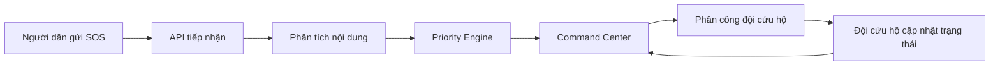
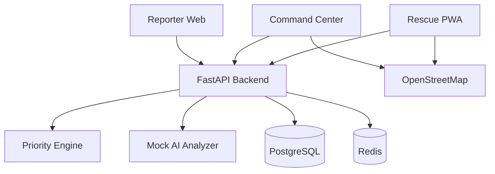

# SOSFlow

SOSFlow là MVP web hỗ trợ tiếp nhận, phân tích, ưu tiên và điều phối yêu cầu cứu hộ trong thiên tai. Dự án tập trung vào một vấn đề rất cụ thể: khi có quá nhiều lời cầu cứu đến cùng lúc, Ban Chỉ huy cần biết trường hợp nào nguy cấp hơn, vì sao nguy cấp, đã giao cho đội nào và tiến độ cứu hộ hiện đang ở đâu.

SOSFlow không thay thế tổng đài khẩn cấp. Hệ thống đóng vai trò như một lớp điều phối phía sau: gom yêu cầu, chuẩn hóa dữ liệu, tính điểm ưu tiên minh bạch, hiển thị lên dashboard và giúp đội cứu hộ cập nhật trạng thái nhiệm vụ.

## Problem Statement

Trong các đợt bão, lũ quét, sạt lở hoặc ngập lụt, yêu cầu cứu hộ thường tăng đột biến trong thời gian ngắn. Thông tin có thể đến từ cuộc gọi, tin nhắn, mạng xã hội, người thân hoặc chính quyền địa phương. Các yêu cầu này thường không đồng nhất: có người chỉ gửi một câu cầu cứu, có người thiếu địa chỉ, có người ghi sai chính tả, có trường hợp nhiều người cùng báo một sự việc.

Vấn đề vận hành chính:

- Tổng đài và điều phối viên dễ bị quá tải khi hàng chục hoặc hàng trăm yêu cầu đến cùng lúc.
- Dữ liệu rời rạc, thiếu cấu trúc, khó tổng hợp thành một danh sách xử lý thống nhất.
- Điều phối viên phải tự đọc từng nội dung để đánh giá mức độ nguy hiểm.
- Không có cách nhất quán để biết yêu cầu nào cần xử lý trước.
- Thiếu giải thích rõ ràng cho quyết định ưu tiên, gây khó kiểm tra và bàn giao ca trực.
- Đội cứu hộ khó theo dõi nhiệm vụ được giao và cập nhật tiến độ về trung tâm.
- Các khu vực Internet yếu hoặc mất tín hiệu khiến thông tin gửi lên không đầy đủ.

Nếu chỉ có một bản đồ SOS, Ban Chỉ huy biết được "có điểm cần cứu", nhưng vẫn chưa biết điểm nào nguy cấp hơn, vì sao cần ưu tiên, trạng thái xử lý là gì, và đội nào đang phụ trách.

## Proposed Solution

SOSFlow giải quyết bài toán bằng một luồng vận hành đơn giản cho MVP:

1. Người dân gửi yêu cầu cứu hộ qua form web.
2. Backend kiểm tra dữ liệu và lưu yêu cầu.
3. Mock AI Analyzer đọc nội dung để phát hiện rủi ro như mắc kẹt, nước cao, có trẻ em, có người bị thương.
4. Rule-based Priority Engine tính điểm ưu tiên dựa trên các yếu tố có thể giải thích.
5. Command Center Dashboard hiển thị danh sách yêu cầu, bản đồ, điểm ưu tiên, lý do ưu tiên và trạng thái.
6. Ban Chỉ huy phân công yêu cầu cho đội cứu hộ.
7. Đội cứu hộ cập nhật tiến độ: `ACCEPTED`, `MOVING`, `ARRIVED`, `RESCUING`, `COMPLETED` hoặc `FAILED`.
8. Dashboard theo dõi toàn bộ vòng đời từ lúc tiếp nhận đến khi hoàn thành.

Giải pháp cụ thể của MVP:

- Reporter Web: form gửi SOS cho người dân, không bắt buộc nhập đủ mọi trường.
- Command Center: dashboard thống kê, bản đồ, bảng yêu cầu, bộ lọc, chi tiết request và thao tác phân công đội.
- Rescue Team View: màn hình nhiệm vụ cho đội cứu hộ, có thông tin nạn nhân, vị trí, mức ưu tiên và nút cập nhật trạng thái.
- Priority Engine: công thức rule-based minh bạch, cấu hình trong `config/priority-rules.yaml`.
- Mock AI Analyzer: interface sẵn để sau này thay bằng Amazon Bedrock hoặc LLM khác.
- Seed data: 10 yêu cầu cứu hộ đủ các mức LOW, MEDIUM, HIGH, CRITICAL và 3 đội cứu hộ.

MVP này chứng minh ba điểm chính: dữ liệu SOS có thể được gom vào một hàng đợi thống nhất, quyết định ưu tiên có thể giải thích được, và tiến độ cứu hộ có thể được cập nhật theo một vòng đời rõ ràng thay vì theo dõi rời rạc qua tin nhắn.

Người dùng chính:

- Reporter: người dân gửi yêu cầu SOS.
- Command Center: Ban Chỉ huy xem, lọc, đánh giá và phân công yêu cầu.
- Rescue Team: đội cứu hộ nhận nhiệm vụ và cập nhật trạng thái hiện trường.

## Các thành phần

- SOSFlow Reporter: trang `/report` để gửi yêu cầu cứu hộ.
- SOSFlow Command Center: dashboard, danh sách yêu cầu, chi tiết yêu cầu và quản lý đội.
- SOSFlow Rescue: trang `/rescue/{team_id}/missions` để đội cứu hộ xử lý nhiệm vụ được giao.

## Luồng hoạt động



## Kiến trúc MVP



Backend là modular monolith để hackathon chạy nhanh và dễ hiểu. Priority Engine và AI Analyzer đã tách module để có thể thay bằng Bedrock hoặc LLM sau này.

## Cơ chế ưu tiên

Priority score được tính từ:

- Mức độ nguy hiểm trong nội dung.
- Số người gặp nạn.
- Trẻ em, người cao tuổi, người khuyết tật, phụ nữ mang thai.
- Số người bị thương và dấu hiệu bất tỉnh.
- Tình trạng mắc kẹt.
- Mực nước.
- Thời gian chờ.

Mức ưu tiên:

- 0-29: LOW
- 30-49: MEDIUM
- 50-69: HIGH
- 70 trở lên: CRITICAL

Ví dụ: một yêu cầu có 6 người, 2 trẻ em, đang mắc kẹt, nước trên 2,5m và nội dung có dấu hiệu nguy hiểm tính mạng sẽ được cộng điểm từ từng yếu tố. Dashboard hiển thị cả số điểm và danh sách lý do để điều phối viên kiểm tra được.

Rules nằm tại `config/priority-rules.yaml`.

## Công nghệ

- Frontend: React, TypeScript, Vite, Tailwind CSS.
- Map: Leaflet, OpenStreetMap.
- Backend: Python, FastAPI, SQLAlchemy, Pydantic, Alembic.
- Database: PostgreSQL trong Docker Compose; SQLite cho local nhanh.
- Cache placeholder: Redis trong Docker Compose.
- Container: Docker, Docker Compose.

## Cấu trúc thư mục

```text
sosflow/
├── frontend/
├── backend/
├── docs/
├── config/
├── docker-compose.yml
├── .env.example
└── README.md
```

## Hướng dẫn chạy local

```bash
git clone <repository-url>
cd sosflow
cp .env.example .env
docker compose up --build
```

Nếu máy đã dùng các cổng PostgreSQL/Redis mặc định, chạy demo song song mà không chiếm `5432/6379`:

```bash
DEMO_TOKEN=sosflow-demo docker compose -f docker-compose.local-demo.yml up --build
```

Khi đó mở frontend tại `http://localhost:5174`, backend tại `http://localhost:8001`, rồi vào Dashboard và bấm **Start x1** trong Demo control.

Địa chỉ:

- Frontend: http://localhost:5173
- Backend: http://localhost:8000
- API docs: http://localhost:8000/docs

Chạy test priority engine local:

```bash
cd backend
PYTHONPATH=. pytest
```

Trước khi chạy backend trên database hiện có, áp dụng migration một lần:

```bash
cd backend
PYTHONPATH=. alembic upgrade head
```

### Quyết định aging

Backend lưu tất cả timestamp ở UTC và API tuần tự hóa chúng theo ISO 8601 có hậu tố `Z`; frontend dùng `Date`/`toLocaleString` để hiển thị múi giờ thiết bị. Aging được tính bằng tham số `now` của Priority Engine. Khi tải danh sách, chi tiết hoặc statistics, backend chỉ refresh các request chưa kết thúc có `priority_calculated_at` cũ hơn 5 phút. Vì vậy điểm chờ tăng theo thời gian nhưng GET không ghi database liên tục. Test có thể truyền thời gian giả lập trực tiếp vào engine.

### Vòng đời và tính toàn vẹn

Request code có dạng `SOS-YYYYMMDD-000123-<token>`: phần ID hỗ trợ đọc và sắp xếp, token UUID ngắn loại trừ va chạm ngay cả với SQLite cũ có thể tái sử dụng ID sau khi xóa. Request chỉ chuyển theo ma trận `PENDING_VERIFICATION → VERIFIED → ASSIGNED → ACCEPTED → MOVING → ARRIVED → RESCUING → COMPLETED|FAILED`. Xác minh dùng API cập nhật request; assignment và các trạng thái sau đó chỉ đi qua transaction service tương ứng. Mỗi bước tạo `StatusHistory`; các lần tính lại priority cũng được ghi audit với trạng thái giữ nguyên. Database có partial unique index để một request và một team chỉ có tối đa một mission đang hoạt động.

### Multi-source simulator và báo cáo trùng

`WEB`, `CALL_112`, `PHONE`, `SMS`, `ZALO`, `SOCIAL_MEDIA`, `LOCAL_OFFICER` và `OFFLINE_SYNC` đều đi qua một intake service. Đây là **simulator**: SOSFlow không kết nối SMS gateway, Zalo API, tổng đài 112 hoặc What3words API thật trong MVP này.

Idempotency dùng `client_submission_id` hoặc cặp `source` + `external_reference`; retry trả về report cũ. Sau khi nhận tin, engine tạo đề xuất `POSSIBLE_DUPLICATE` có điểm/lý do giải thích từ vị trí, thời điểm, địa chỉ, điện thoại, nội dung chuẩn hóa và tín hiệu rule-AI. Không có auto-merge: admin phải xác nhận rồi mới gộp report vào canonical incident; report gốc và audit history luôn được giữ lại.

Để chạy cảnh demo nhiều nguồn:

```bash
DEMO_MODE=true DEMO_TOKEN=sosflow-demo docker compose up --build
python3 scripts/simulate_disaster.py --token sosflow-demo
```

Script bơm 12 report qua API thật, trong đó có 112/SMS/cán bộ/offline sync và ba report cùng khu vực cầu Trà Linh. Demo endpoint chỉ được mount khi `DEMO_MODE=true` và cần header `X-Demo-Token`. Điểm `///slipped.awkward.scarecrow` được giữ như một liên kết What3words trong report demo để mở trực tiếp từ popup; không tự suy diễn tọa độ khi chưa có API key What3words.

### Command Center Dashboard

Dashboard tổng hợp bằng database aggregation: phân bố priority/status/source, chuỗi tin báo 24 giờ (và theo phút khi demo), thời gian chờ/giao đội/đến hiện trường/hoàn tất trung bình, đội khả dụng và cảnh báo vận hành. Trong `DEMO_MODE=true`, Dashboard polling mỗi 5 giây và tự dừng khi rời trang; ngoài demo chỉ làm mới thủ công. Bản đồ fit theo các marker hiện có, giảm độ nổi bật report đã đóng, không lỗi khi thiếu tọa độ và cho phép click mở Request Detail.

### Bedrock analyzer và gợi ý đội

Mặc định `AI_PROVIDER=mock`, nên demo không cần AWS. Đặt `AI_PROVIDER=bedrock` cùng model ID hoặc inference profile/custom model ARN để dùng Amazon Bedrock Converse API qua default credential chain của boto3. Output được kiểm tra theo JSON schema/Pydantic; timeout, throttling, quyền model hoặc structured output không hợp lệ sẽ lưu mã lỗi an toàn và fallback sang mock khi `AI_FALLBACK_ENABLED=true`, không làm mất report. AI chỉ lưu suggestion/metadata riêng, không ghi đè dữ liệu người báo đã nhập, không tự giao đội hoặc phát lệnh cứu hộ. Có thể đánh giá dataset tổng hợp 40 mẫu bằng `python3 scripts/evaluate_analyzer.py --provider mock`; xem [hướng dẫn customization](docs/12-bedrock-customization.md) trước khi tạo bất kỳ job có chi phí nào.

Request Detail hiển thị tối đa ba đội `AVAILABLE` được chấm điểm minh bạch theo khoảng cách Haversine (đường thẳng, không phải ETA), năng lực, thiết bị, sức chứa và active mission. Điều phối viên vẫn phải bấm assign. Mission hỗ trợ `BLOCKED` và `NEED_REINFORCEMENT`; từng bước (assigned, departed, route blocked, reinforcement, completed/failed...) có MissionEvent với actor, ghi chú, thời điểm và tọa độ tùy chọn.

### PWA offline-first và vùng im lặng

Reporter là PWA có manifest, service worker, offline shell và icon placeholder. Service worker chỉ cache application shell/static asset; **không cache API**, vì response quản trị có thể nhạy cảm. Khi mất mạng, form SOS được lưu ở IndexedDB với mã `LOCAL-...`, `client_submission_id`, payload, retry/error state; reload không làm mất queue. Khi có mạng, listener online hoặc nút **Đồng bộ ngay** gửi lại qua pipeline chuẩn với `source=OFFLINE_SYNC`, giữ `received_at` tại thiết bị và `synced_at` phía server. Retry dùng backoff và idempotency ngăn tạo trùng record. Attachment và audio transcription chưa được triển khai.

Silent zone chỉ là cảnh báo **cần xác minh**: khu vực có hazard đang active nhưng vượt ngưỡng không có tin. Dashboard vẽ layer riêng, hiển thị thời gian im lặng và audit các quyết định `VERIFYING`, `SAFE`, `NEED_RESCUE`; không kết luận khu vực chắc chắn có nạn nhân.

Trong `DEMO_MODE=true`, Dashboard có control panel scenario “Lũ quét và sạt lở Trà Linh”: Start, Pause, event kế tiếp, bơm tất cả, Reset và speed x1/x2/x5. Events đi qua API thật; reset chỉ xóa report/team/zone simulator. Xem [live demo script](docs/13-live-demo-script.md) để trình bày 3–5 phút.

Xem [Current MVP](docs/14-current-mvp.md) để biết chính xác phần đã triển khai, demo accounts (MVP chưa có authentication), Bedrock setup, hướng AWS deployment và giới hạn hiện tại.

## API chính

- `POST /api/rescue-requests`: Reporter gửi yêu cầu SOS.
- `GET /api/rescue-requests/{request_code}/status`: xem trạng thái yêu cầu.
- `GET /api/admin/rescue-requests`: danh sách phân trang (`items`, `page`, `page_size`, `total`), filter và sort.
- `GET /api/admin/rescue-requests/{id}`: chi tiết yêu cầu.
- `PATCH /api/admin/rescue-requests/{id}`: cập nhật thông tin.
- `POST /api/admin/rescue-requests/{id}/reanalyze`: chạy lại analyzer, chỉ cập nhật AI suggestion.
- `GET /api/admin/rescue-requests/{id}/team-recommendations`: tối đa ba đề xuất đội có lý do/cảnh báo.
- `GET /api/admin/rescue-requests/{id}/timeline`: lịch sử trạng thái/audit recalculation.
- `GET /api/admin/rescue-requests/{id}/duplicates`: các đề xuất trùng có điểm và lý do.
- `POST /api/admin/rescue-requests/{id}/duplicates/{candidate_id}/confirm|reject`: quyết định của admin.
- `POST /api/admin/rescue-requests/{id}/merge`: gộp report đã xác nhận vào canonical incident, không xóa report gốc.
- `POST /api/admin/rescue-requests/{id}/assign`: phân công đội.
- `GET /api/admin/statistics`: thống kê dashboard.
- `GET /api/admin/silent-zones`: các khu vực cần xác minh; `PATCH /api/admin/silent-zones/{id}/verification` ghi audit.
- `GET /api/rescue-teams`: danh sách đội.
- `GET /api/missions/{id}/events`: timeline event của nhiệm vụ.
- `POST /api/rescue-teams`: tạo đội.
- `GET /api/rescue-teams/{id}/missions`: nhiệm vụ của đội.
- `PATCH /api/missions/{id}/status`: đội cứu hộ cập nhật trạng thái.

## Demo scenario

1. Mở `/report` và gửi tin SOS.
2. Backend phân tích nội dung, tính điểm và lưu request.
3. Mở `/admin/dashboard`, yêu cầu mới xuất hiện trên bảng và bản đồ.
4. Vào `/admin/requests/{id}`, xem lý do ưu tiên và giao đội.
5. Mở `/rescue/{team_id}/missions`, đội cứu hộ cập nhật `ACCEPTED`, `MOVING`, `ARRIVED`, `RESCUING`.
6. Cập nhật `COMPLETED`, dashboard ghi nhận nhiệm vụ hoàn thành.
7. Trong demo mode, dùng panel Trà Linh để bơm scenario và reset an toàn.

## Giới hạn của MVP

Current MVP:

- Chưa tích hợp SMS Gateway thật.
- Chưa tích hợp Zalo API thật.
- Chưa xử lý cuộc gọi thật.
- Bedrock chỉ hoạt động khi có IAM/model access; mặc định vẫn là mock fallback.
- Chưa có dữ liệu thời tiết thời gian thực.
- Chưa tối ưu điều phối theo tuyến đường.
- Chưa triển khai xác thực production.

Điểm quan trọng: các mục trên là giới hạn có chủ đích để MVP tập trung vào luồng vận hành cốt lõi. Bản demo ưu tiên tính dễ chạy, dễ hiểu và dễ trình bày hơn là mô phỏng đầy đủ hệ thống khẩn cấp production.

Future Development:

- Tích hợp SMS Gateway và đầu số khẩn cấp.
- Tích hợp Zalo và các nguồn mạng xã hội.
- Chuyển giọng nói thành dữ liệu có cấu trúc.
- Dùng Amazon Bedrock hoặc LLM để phân tích tiếng Việt tự do.
- Khử trùng lặp theo vị trí và ngữ nghĩa.
- Tích hợp dữ liệu thời tiết và cảnh báo thiên tai.
- Đề xuất đội cứu hộ dựa trên khoảng cách, phương tiện và năng lực.
- Theo dõi audit log cho toàn bộ quyết định.
- Phân quyền theo cơ quan và địa phương.
- Triển khai trên AWS.
- Mở rộng bằng Kubernetes khi số lượng người dùng và yêu cầu tăng.
- Mở rộng sang cháy nổ, tai nạn giao thông, cấp cứu y tế và tìm kiếm người mất tích.

Demo accounts: chưa có. MVP chưa triển khai authentication/authorization production.
