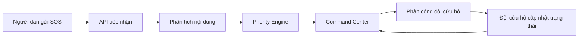
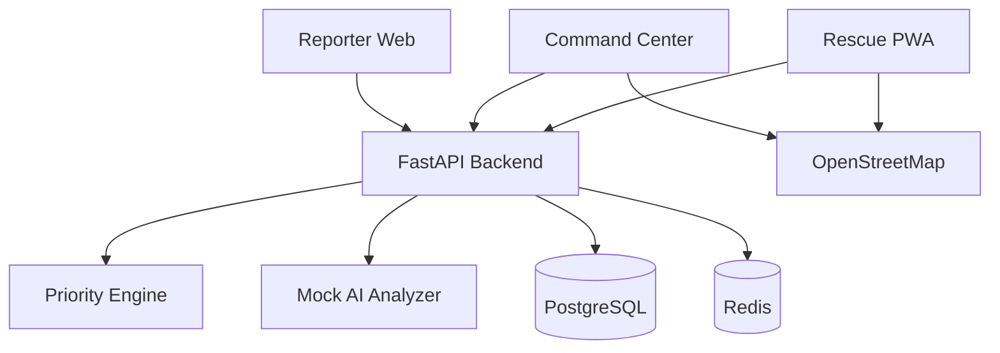

# SOSFlow

SOSFlow là MVP web hỗ trợ tiếp nhận, phân tích, ưu tiên và điều phối yêu cầu cứu hộ trong thiên tai. Dự án tập trung vào một vấn đề rất cụ thể: khi có quá nhiều lời cầu cứu đến cùng lúc, Ban Chỉ huy cần biết trường hợp nào nguy cấp hơn, vì sao nguy cấp, đã giao cho đội nào và tiến độ cứu hộ hiện đang ở đâu.

SOSFlow không thay thế tổng đài khẩn cấp. Hệ thống đóng vai trò như một lớp điều phối phía sau: gom yêu cầu, chuẩn hóa dữ liệu, tính điểm ưu tiên minh bạch, hiển thị lên dashboard và giúp đội cứu hộ cập nhật trạng thái nhiệm vụ.

## Problem Statement

Trong các đợt bão, lũ quét, sạt lở hoặc ngập lụt, yêu cầu cứu hộ thường tăng đột biến trong thời gian ngắn. Thông tin có thể đến từ cuộc gọi, tin nhắn, mạng xã hội, người thân hoặc chính quyền địa phương. Các yêu cầu này thường không đồng nhất: có người chỉ gửi một câu cầu cứu, có người thiếu địa chỉ, có người ghi sai chính tả, có trường hợp nhiều người cùng báo một sự việc.

Vấn đề vận hành chính:

- Tổng đài và điều phối viên dễ bị quá tải khi hàng chục hoặc hàng trăm yêu cầu đến cùng lúc.
- Dữ liệu rời rạc, thiếu cấu trúc, khó tổng hợp thành một danh sách xử lý thống nhất.
- Điều phối viên phải tự đọc từng nội dung để đánh giá mức độ nguy hiểm.
- Không có cách nhất quán để biết yêu cầu nào cần xử lý trước.
- Thiếu giải thích rõ ràng cho quyết định ưu tiên, gây khó kiểm tra và bàn giao ca trực.
- Đội cứu hộ khó theo dõi nhiệm vụ được giao và cập nhật tiến độ về trung tâm.
- Các khu vực Internet yếu hoặc mất tín hiệu khiến thông tin gửi lên không đầy đủ.

Nếu chỉ có một bản đồ SOS, Ban Chỉ huy biết được "có điểm cần cứu", nhưng vẫn chưa biết điểm nào nguy cấp hơn, vì sao cần ưu tiên, trạng thái xử lý là gì, và đội nào đang phụ trách.

## Proposed Solution

SOSFlow giải quyết bài toán bằng một luồng vận hành đơn giản cho MVP:

1. Người dân gửi yêu cầu cứu hộ qua form web.
2. Backend kiểm tra dữ liệu và lưu yêu cầu.
3. Mock AI Analyzer đọc nội dung để phát hiện rủi ro như mắc kẹt, nước cao, có trẻ em, có người bị thương.
4. Rule-based Priority Engine tính điểm ưu tiên dựa trên các yếu tố có thể giải thích.
5. Command Center Dashboard hiển thị danh sách yêu cầu, bản đồ, điểm ưu tiên, lý do ưu tiên và trạng thái.
6. Ban Chỉ huy phân công yêu cầu cho đội cứu hộ.
7. Đội cứu hộ cập nhật tiến độ: `ACCEPTED`, `MOVING`, `ARRIVED`, `RESCUING`, `COMPLETED` hoặc `FAILED`.
8. Dashboard theo dõi toàn bộ vòng đời từ lúc tiếp nhận đến khi hoàn thành.

Giải pháp cụ thể của MVP:

- Reporter Web: form gửi SOS cho người dân, không bắt buộc nhập đủ mọi trường.
- Command Center: dashboard thống kê, bản đồ, bảng yêu cầu, bộ lọc, chi tiết request và thao tác phân công đội.
- Rescue Team View: màn hình nhiệm vụ cho đội cứu hộ, có thông tin nạn nhân, vị trí, mức ưu tiên và nút cập nhật trạng thái.
- Priority Engine: công thức rule-based minh bạch, cấu hình trong `config/priority-rules.yaml`.
- Mock AI Analyzer: interface sẵn để sau này thay bằng Amazon Bedrock hoặc LLM khác.
- Seed data: 10 yêu cầu cứu hộ đủ các mức LOW, MEDIUM, HIGH, CRITICAL và 3 đội cứu hộ.

MVP này chứng minh ba điểm chính: dữ liệu SOS có thể được gom vào một hàng đợi thống nhất, quyết định ưu tiên có thể giải thích được, và tiến độ cứu hộ có thể được cập nhật theo một vòng đời rõ ràng thay vì theo dõi rời rạc qua tin nhắn.

Người dùng chính:

- Reporter: người dân gửi yêu cầu SOS.
- Command Center: Ban Chỉ huy xem, lọc, đánh giá và phân công yêu cầu.
- Rescue Team: đội cứu hộ nhận nhiệm vụ và cập nhật trạng thái hiện trường.

## Các thành phần

- SOSFlow Reporter: trang `/report` để gửi yêu cầu cứu hộ.
- SOSFlow Command Center: dashboard, danh sách yêu cầu, chi tiết yêu cầu và quản lý đội.
- SOSFlow Rescue: trang `/rescue/{team_id}/missions` để đội cứu hộ xử lý nhiệm vụ được giao.

## Luồng hoạt động



## Kiến trúc MVP



Backend là modular monolith để hackathon chạy nhanh và dễ hiểu. Priority Engine và AI Analyzer đã tách module để có thể thay bằng Bedrock hoặc LLM sau này.

## Cơ chế ưu tiên

Priority score được tính từ:

- Mức độ nguy hiểm trong nội dung.
- Số người gặp nạn.
- Trẻ em, người cao tuổi, người khuyết tật, phụ nữ mang thai.
- Số người bị thương và dấu hiệu bất tỉnh.
- Tình trạng mắc kẹt.
- Mực nước.
- Thời gian chờ.

Mức ưu tiên:

- 0-29: LOW
- 30-49: MEDIUM
- 50-69: HIGH
- 70 trở lên: CRITICAL

Ví dụ: một yêu cầu có 6 người, 2 trẻ em, đang mắc kẹt, nước trên 2,5m và nội dung có dấu hiệu nguy hiểm tính mạng sẽ được cộng điểm từ từng yếu tố. Dashboard hiển thị cả số điểm và danh sách lý do để điều phối viên kiểm tra được.

Rules nằm tại `config/priority-rules.yaml`.

## Công nghệ

- Frontend: React, TypeScript, Vite, Tailwind CSS.
- Map: Leaflet, OpenStreetMap.
- Backend: Python, FastAPI, SQLAlchemy, Pydantic, Alembic.
- Database: PostgreSQL trong Docker Compose; SQLite cho local nhanh.
- Cache placeholder: Redis trong Docker Compose.
- Container: Docker, Docker Compose.

## Cấu trúc thư mục

```text
sosflow/
├── frontend/
├── backend/
├── docs/
├── config/
├── docker-compose.yml
├── .env.example
└── README.md
```

## Hướng dẫn chạy local

```bash
git clone <repository-url>
cd sosflow
cp .env.example .env
docker compose up --build
```

Địa chỉ:

- Frontend: http://localhost:5173
- Backend: http://localhost:8000
- API docs: http://localhost:8000/docs

Chạy test priority engine local:

```bash
cd backend
PYTHONPATH=. pytest
```

## API chính

- `POST /api/rescue-requests`: Reporter gửi yêu cầu SOS.
- `GET /api/rescue-requests/{request_code}/status`: xem trạng thái yêu cầu.
- `GET /api/admin/rescue-requests`: danh sách yêu cầu, hỗ trợ filter.
- `GET /api/admin/rescue-requests/{id}`: chi tiết yêu cầu.
- `PATCH /api/admin/rescue-requests/{id}`: cập nhật thông tin.
- `POST /api/admin/rescue-requests/{id}/assign`: phân công đội.
- `GET /api/admin/statistics`: thống kê dashboard.
- `GET /api/rescue-teams`: danh sách đội.
- `POST /api/rescue-teams`: tạo đội.
- `GET /api/rescue-teams/{id}/missions`: nhiệm vụ của đội.
- `PATCH /api/missions/{id}/status`: đội cứu hộ cập nhật trạng thái.

## Demo scenario

1. Mở `/report` và gửi tin SOS.
2. Backend phân tích nội dung, tính điểm và lưu request.
3. Mở `/admin/dashboard`, yêu cầu mới xuất hiện trên bảng và bản đồ.
4. Vào `/admin/requests/{id}`, xem lý do ưu tiên và giao đội.
5. Mở `/rescue/{team_id}/missions`, đội cứu hộ cập nhật `ACCEPTED`, `MOVING`, `ARRIVED`, `RESCUING`.
6. Cập nhật `COMPLETED`, dashboard ghi nhận nhiệm vụ hoàn thành.

## Giới hạn của MVP

Current MVP:

- Chưa tích hợp SMS Gateway thật.
- Chưa tích hợp Zalo API thật.
- Chưa xử lý cuộc gọi thật.
- AI hiện dùng rule hoặc mock service.
- Chưa có dữ liệu thời tiết thời gian thực.
- Chưa tối ưu điều phối theo tuyến đường.
- Chưa triển khai xác thực production.

Điểm quan trọng: các mục trên là giới hạn có chủ đích để MVP tập trung vào luồng vận hành cốt lõi. Bản demo ưu tiên tính dễ chạy, dễ hiểu và dễ trình bày hơn là mô phỏng đầy đủ hệ thống khẩn cấp production.

Future Development:

- Tích hợp SMS Gateway và đầu số khẩn cấp.
- Tích hợp Zalo và các nguồn mạng xã hội.
- Chuyển giọng nói thành dữ liệu có cấu trúc.
- Dùng Amazon Bedrock hoặc LLM để phân tích tiếng Việt tự do.
- Hỗ trợ PWA offline và store-and-forward.
- Đồng bộ khi thiết bị bắt lại được kết nối.
- Khử trùng lặp theo vị trí và ngữ nghĩa.
- Nhận diện vùng im lặng hoặc khu vực mất tín hiệu.
- Tích hợp dữ liệu thời tiết và cảnh báo thiên tai.
- Đề xuất đội cứu hộ dựa trên khoảng cách, phương tiện và năng lực.
- Theo dõi audit log cho toàn bộ quyết định.
- Phân quyền theo cơ quan và địa phương.
- Triển khai trên AWS.
- Mở rộng bằng Kubernetes khi số lượng người dùng và yêu cầu tăng.
- Mở rộng sang cháy nổ, tai nạn giao thông, cấp cứu y tế và tìm kiếm người mất tích.

Tài khoản giả lập:

- Admin: `admin@sosflow.local`
- Rescue Team: `rescue@sosflow.local`
