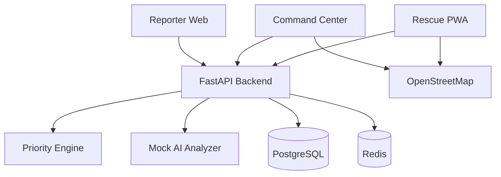

# Architecture

Frontend gọi FastAPI qua REST API. Backend lưu dữ liệu bằng SQLAlchemy, phân tích nội dung bằng mock analyzer và tính priority bằng rules trong YAML.

Data flow chính:

1. Reporter gửi payload SOS vào API.
2. API validate và gọi analyzer để trích xuất rủi ro.
3. Priority Engine tính score và reasons.
4. Request được lưu vào database và xuất hiện trên dashboard.
5. Command Center tạo mission khi phân công đội cứu hộ.
6. Rescue Team cập nhật mission status để đồng bộ lại dashboard.

MVP dùng modular monolith thay vì microservices vì ít thành phần vận hành hơn, dễ demo hơn và đủ tách module để thay thế sau này. Khi mở rộng, có thể tách ingestion, AI extraction, dispatch optimization, notification và audit log thành service riêng.
