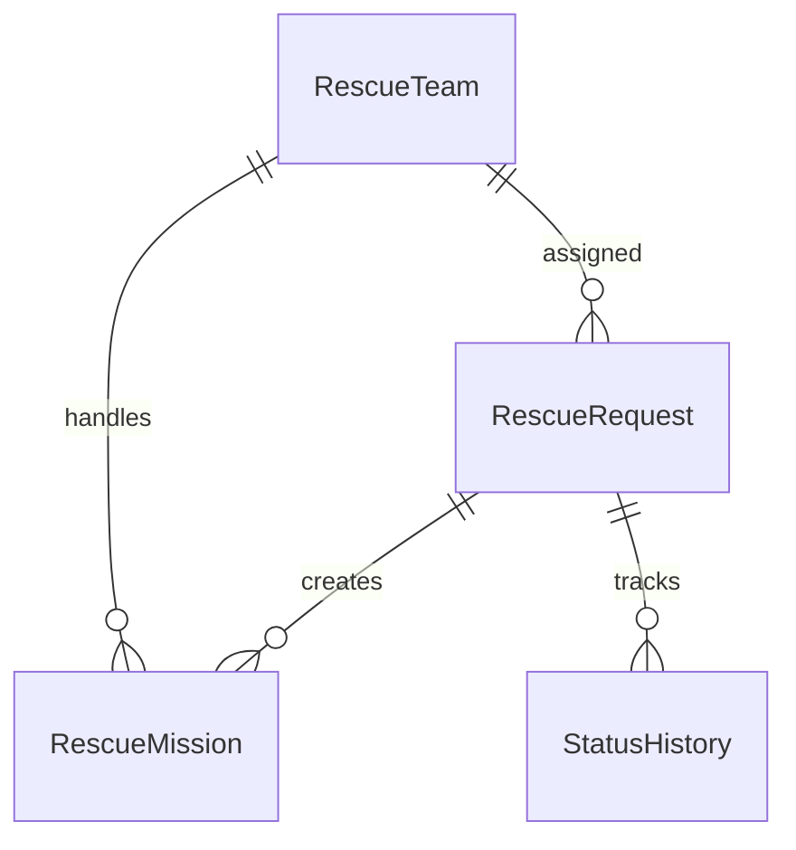

# Data Model

## Entity

- RescueRequest: yêu cầu cứu hộ, điểm ưu tiên, trạng thái và đội được giao.
- RescueTeam: đội cứu hộ, phương tiện, vị trí và trạng thái.
- RescueMission: nhiệm vụ gắn request với team.
- StatusHistory: lịch sử thay đổi trạng thái.

Nhóm dữ liệu quan trọng của `RescueRequest`:

- Thông tin liên hệ: tên, số điện thoại.
- Nội dung SOS: message, address, latitude, longitude.
- Tình trạng nguy hiểm: số người, trẻ em, người cao tuổi, bị thương, mắc kẹt, mực nước.
- Điều phối: priority score, priority level, reasons, status, assigned team.

