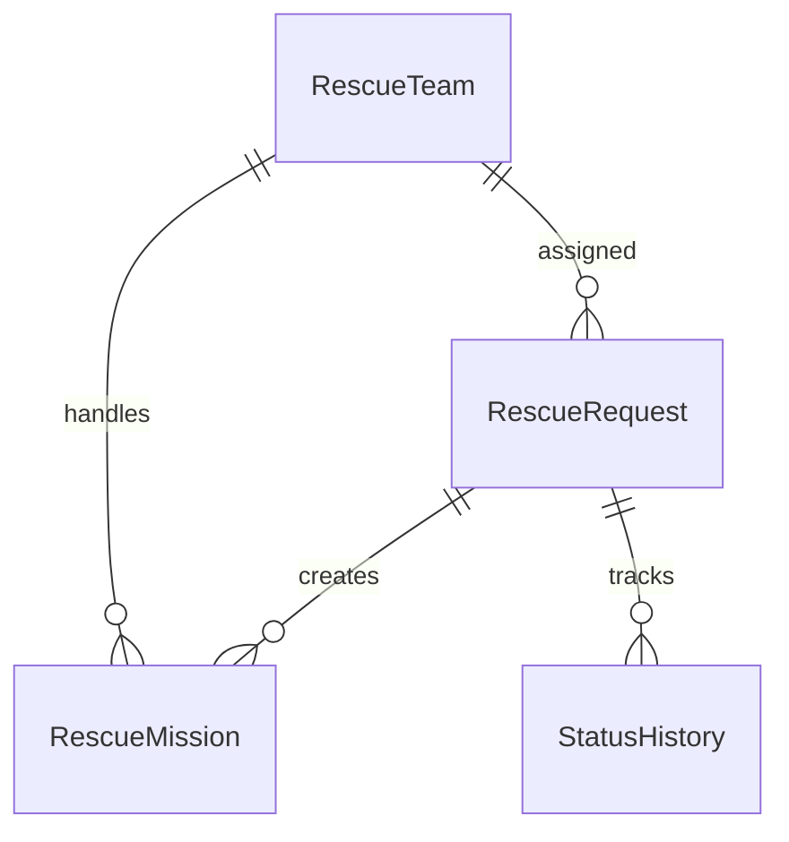

# Data Model

## Entity

- RescueRequest: yêu cầu cứu hộ, điểm ưu tiên, trạng thái và đội được giao.
- RescueTeam: đội cứu hộ, phương tiện, vị trí và trạng thái.
- RescueMission: nhiệm vụ gắn request với team.
- StatusHistory: lịch sử thay đổi trạng thái.

